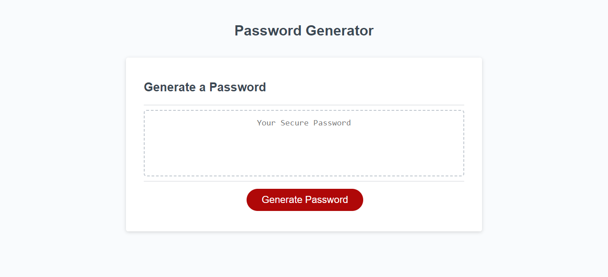

## Description
This is the Password Generator which you can generate a password with the option of your choice.

# Deployed link
https://jameshii26.github.io/Password-Generator/

# Repo link source code
https://github.com/jameshii26/Password-Generator

## Screen shot

# Table content

## Usage
This is a Password Generator, a very useful tool which you can generate a password with the option of your choice. 

How to use it?

 1. Click the Red "Generate Password" button to start
 2. Input the number of characters you want your password to be (password must be between 8-64 characters).
 3. Click 'OK' to inlcude or 'cancel' to exclude the numeric character.
 4. Click 'OK' to inlcude or 'cancel' to exclude the special character
 5. Click 'OK' to inlcude or 'cancel' to exclude the lower case character.
 6. Click 'OK' to inlcude or 'cancel' to exclude the upper case character.
 7. Congratulation! Your password had been generated!!
  
# Credits
N/A

# License
MIT. Please refer to the LICENSE in the repo.